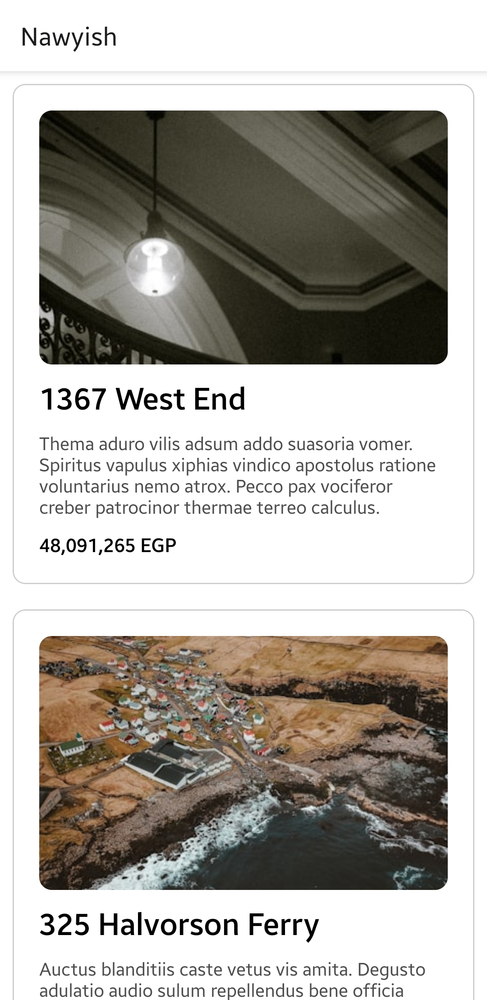
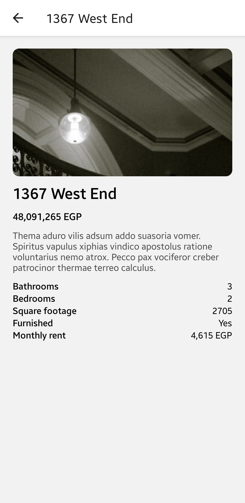

# Nawyish

## Installation

### If you trust me

1. Clone the repository.
2. `cd` into the repository.
3. Run `docker compose up -d` to start the backend and frontend.
4. Read the [mobile README](./mobile/README.md) to start the mobile app.
5. Don't read the inner READMEs. We've already formed a bond of trust. I won't let you down.
6. To stop the containers, run `docker compose down`.

The server will be running on <http://localhost:3000> and the frontend will be running on <http://localhost:4000>.

The API documentation is available at <http://localhost:3000/doc>.

On first run, the backend will seed the database so you don't have to worry about that.

> You'll notice a complete lack of auth. It's okay, don't worry about it :)

#### Here are screenshots of the running app

### If you don't trust me

Here are the READMEs for [backend](./backend/README.md), [web](./web/README.md), and [mobile](./mobile/README.md). Have fun with the setup!
