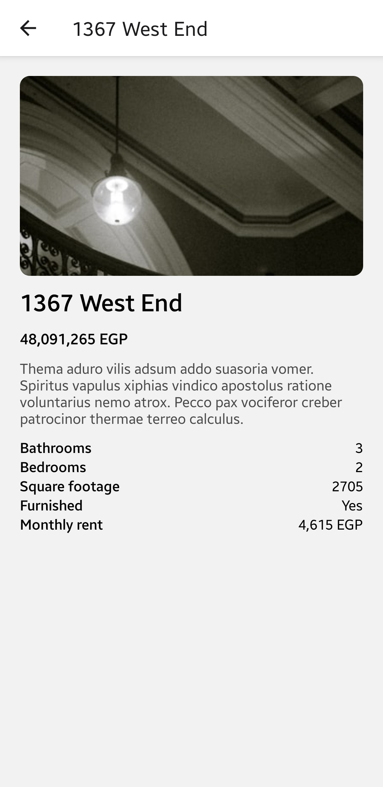

# Nawyish - Mobile

## Description

This is the mobile app for the Nawyish project. It is built with React Native and uses Expo to manage the build process.

## Installation

Run `npm ci` to install the necessary dependencies.

## Usage

Run `npm start` to start the app. For me, I just scanned the QR code with the Expo app on my phone. If you're a fancy mobile dev,
you probably can run it on an emulator or something.

On first run, you'll be prompted to enter the URL of the backend. This is should be the IP address of the machine running the backend and the port it's running on. For example, `http://192.168.1.103:3000`.

## Screenshots

